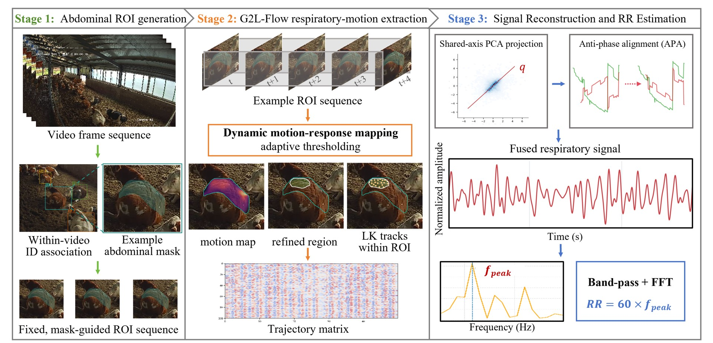

# Multi-view-Cattle-RR-Estimation

A multi-view cattle respiratory-rate estimation project based on abdominal-region observations under practical farm conditions.

## 🔥 Overview



## 1️⃣ Data

The dataset contains RGB abdominal-region images and their corresponding annotations. The images are organized into training, validation, and test splits. Source videos are not included in the release.

The complete image and annotation package will be shared separately:

To download the dataset, please download all files from [this Baidu Netdisk link](https://pan.baidu.com/s/1hLCwoc6B8VnK4tdvi-YTrQ).

For the extraction code, please contact [bsdai@neau.edu.cn](mailto:bsdai@neau.edu.cn).

### 📁 Dataset Structure

```text
dataset/
├── images/
│   ├── train/
│   ├── val/
│   └── test/
├── labels/
│   ├── train/
│   ├── val/
│   └── test/
└── data.yaml
```

The dataset contains 3,613 image-label pairs in total.

The dataset contains 3,613 image-label pairs in total. The annotated class is abdominal (class ID: 0). Label files use the YOLO segmentation format and share the corresponding image filename stem.

## 2️⃣ Results

### Abdominal ROI Segmentation Model Comparison

| Model | Params (M) ↓ | GFLOPs ↓ | Mask mAP50 (%) ↑ | Mask mAP50:95 (%) ↑ | Processing time (ms/image, mean ± SD) |
| --- | ---: | ---: | ---: | ---: | ---: |
| Mask R-CNN | 43.97 | 190.98 | 54.21 | 18.84 | 92.66 ± 9.90 |
| YOLACT | 34.73 | 148.36 | 13.58 | 3.27 | 194.45 ± 95.69 |
| SOLOv2 | 46.23 | 284.24 | 13.95 | 3.30 | 179.42 ± 35.78 |
| YOLOv8n-seg | 3.26 | 11.15 | 80.69 | 32.67 | 225.65 ± 97.81 |
| YOLO11n-seg | 2.83 | 9.44 | 80.85 | 32.34 | 293.96 ± 116.41 |
| YOLO26n-seg | 2.69 | 8.89 | 78.64 | 30.23 | 247.91 ± 108.27 |

### Ablation of Trajectory Projection and APA for Respiratory Signal Reconstruction

| Method | MAE (95% CI) | RMSE (95% CI) | MAPE (95% CI) | Bias (95% CI) | Pearson r (95% CI) ↑ |
| --- | --- | --- | --- | --- | --- |
| Vertical | 3.55 [2.92, 4.38] | 5.22 [4.25, 6.33] | 9.49 [7.79, 11.81] | 0.99 [0.08, 2.03] | 0.70 [0.52, 0.82] |
| SA-PCA | 3.34 [3.03, 3.72] | 4.33 [3.81, 5.00] | 9.02 [8.02, 10.20] | 0.68 [-0.09, 1.64] | 0.78 [0.67, 0.85] |
| Full | 2.67 [2.36, 3.05] | 3.39 [2.97, 3.86] | 7.19 [6.37, 8.26] | 0.63 [0.05, 1.28] | 0.86 [0.80, 0.90] |
